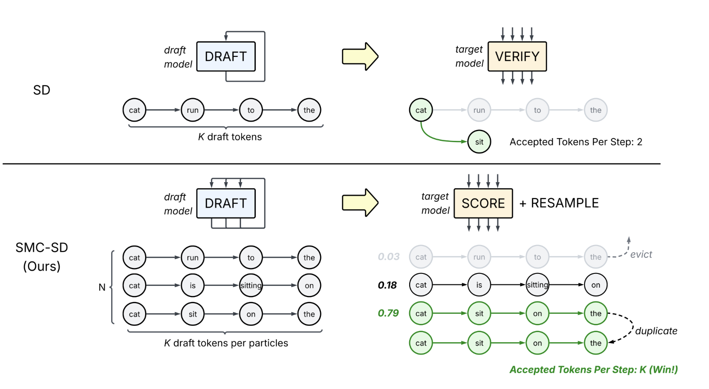

# SMC Speculative Decoding

> **Warning:** This repository is under active development. APIs, configuration flags, and internal interfaces may go through breaking changes.

This repository implements **Sequential Monte Carlo Speculative Decoding (SMC-SD)** on top of [SGLang](https://github.com/sgl-project/sglang). SMC-SD is a population-based alternative to rejection-based speculative decoding: N particles maintain parallel generation paths, weighted by target/draft likelihood ratios, and resampled when effective sample size drops. All drafted tokens are accepted (no rejection), and throughput scales with batch size by increasing arithmetic intensity toward the GPU compute bound.

Paper: [*Faster LLM Inference via Sequential Monte Carlo*](https://arxiv.org/abs/2604.15672)



## Installation

This repo vendors a patched SGLang as a git submodule at `3rdparty/sglang`. Two branches are available:

- **`main`** — pins SGLang at `smc_v2_clean` (older upstream snapshot, torch ~2.5, CUDA 12.4). Stable.
- **`upstream`** — pins SGLang at `smc_v2_clean-upstream-sync-2` (smc_v2_clean + latest `upstream/main` merged in). Requires **CUDA 13**, `torch==2.11.0`, and `sglang-kernel==0.4.2` (formerly `sgl-kernel`; same import path, new pip name).

Pick one before installing.

**Host requirements (`upstream` branch only):** CUDA 13 toolkit installed (provides `libnvrtc.so.13`). On CUDA 12 systems the prebuilt `sglang-kernel` wheel will fail to load with an undefined-symbol or `libnvrtc.so.13: cannot open shared object file` error. The Python deps (`torch==2.11.0`, `sglang-kernel==0.4.2`) are pinned by the SGLang submodule's `pyproject.toml` and will be resolved automatically.

`SMCEngine` will not import until the patched SGLang submodule is both checked out and installed. If you hit `ModuleNotFoundError: No module named 'sglang'`, run:

```bash
git submodule update --init --recursive
uv pip install -e 3rdparty/sglang/python
uv pip install -e .
```

```bash
# 1. Clone with submodules — pick the branch you want
git clone --recurse-submodules --branch main     https://github.com/abdelfattah-lab/smcsd.git
# OR for the latest upstream-merged build (needs CUDA 13):
# git clone --recurse-submodules --branch upstream https://github.com/abdelfattah-lab/smcsd.git
cd smcsd

# If you already cloned without --recurse-submodules, initialise now:
# git submodule update --init --recursive

# 2. Create a Python 3.12 environment
uv venv --python 3.12
source .venv/bin/activate

# 3. Install the patched SGLang (from the submodule), then this package
uv pip install -e 3rdparty/sglang/python
uv pip install -e .
```

## Quick Start

```bash
# SMC-SD throughput on ShareGPT
python -O scripts/tps_benchmark_scripts/bench_offline_throughput.py \
  --backend smc_engine \
  --model-path meta-llama/Llama-3.1-8B-Instruct \
  --speculative-draft-model-path meta-llama/Llama-3.2-1B-Instruct \
  --smc-n-particles 8 --smc-gamma 8 \
  --smc-draft-temperature 0.7 --smc-target-temperature 0.7 \
  --attention-backend fa3 \
  --mem-fraction-static 0.60 \
  --max-running-requests 1 \
  --cuda-graph-max-bs 8 \
  --dataset-name sharegpt \
  --num-prompts 200
```

```bash
# SMC-SD accuracy on GSM8K (N=12 particles, gamma=8)
python scripts/accuracy_test_gsm8k.py \
  --mode smc_engine \
  --model meta-llama/Llama-3.1-8B-Instruct \
  --draft-model meta-llama/Llama-3.2-1B-Instruct \
  --particles 12 --gamma 8 \
  --temperature 0.7 \
  --attention-backend fa3 \
  --num-questions 400
```


> [!NOTE] 
> When using non-Hopper GPU (such as A100, A6000), specify `--attention-backend` to be `triton`

See [scripts/README.md](scripts/README.md) for more benchmark entrypoints.

## SMC-SD Parameters

| Parameter | Flag | Description |
| --- | --- | --- |
| Particles (N) | `--smc-n-particles` | Number of parallel generation paths per request |
| Gamma (K) | `--smc-gamma` | Draft tokens per speculative step |
| Draft temp | `--smc-draft-temperature` | Sampling temperature for draft model |
| Target temp | `--smc-target-temperature` | Scoring temperature for target model |
| Resample threshold | `--smc-resample-threshold` | Resample when ESS < N × threshold (0 = disable) |

## Architecture

SMC lives in the top-level `smcsd/` package, layered over the patched SGLang via a handful of extension points (`ModelRunner._init_pools`, `ModelRunner._build_dummy_run_spec_info`, `ModelRunner._get_graph_runner_class`, `CudaGraphRunner.get_spec_info`, `Scheduler.init_tp_model_worker`, `TpModelWorker._init_model_runner`).

| Path | Description |
| --- | --- |
| `smcsd/engine.py` | `SMCEngine` — standalone offline engine (bypasses Tokenizer/Detokenizer managers) |
| `smcsd/core/scheduler.py` | `SMCScheduler` + `SMCCoordinator` — slot-based decode loop and resampler |
| `smcsd/core/worker.py` | `SMCWorker` — draft AR loop + target scoring + importance weights |
| `smcsd/core/req_state.py` | `ScheduleBatchSMC` — per-slot decode state, flat slot-major weights, and group lookup |
| `smcsd/core/info.py` | `SMCDraftInput`, `SMCDecodeContext` — spec-info wiring |
| `smcsd/core/kernels/` | Fused Triton kernels (`fused_collect`, `fused_resample_kv`) |
| `smcsd/managers/smc_tp_worker.py` | `SMCTpModelWorker` — wires `SMCModelRunner` into the target TP worker |
| `smcsd/model_executor/smc_model_runner.py` | `SMCModelRunner` — installs refcounted allocator + SMC warmup spec-info |
| `smcsd/model_executor/smc_cuda_graph_runner.py` | `SMCCudaGraphRunner` — `SMCVerifyInput` during CUDA graph capture |
| `smcsd/mem_cache/allocator.py` | `SMCRefCountedTokenAllocator` + `copy_block_table` |
| `smcsd/common/verify.py` | `SMCVerifyInput` + Triton cache-assignment kernel |
| `smcsd/common/utils.py` | Particle cloning, weight normalization, ESS / resample helpers |

See [docs/smc/architecture.md](docs/smc/architecture.md) for the detailed design overview.

## Citation

```bibtex
@misc{smcsd2026,
  title         = {Faster LLM Inference via Sequential Monte Carlo},
  author        = {Emara, Yahya and Barba da Costa, Mauricio and Chang, Chi-Chih
                   and Freer, Cameron and Vieira, Tim and Cotterell, Ryan
                   and Abdelfattah, Mohamed S.},
  year          = {2026},
  eprint        = {2604.15672},
  archivePrefix = {arXiv},
  primaryClass  = {cs.LG},
  url           = {https://arxiv.org/abs/2604.15672},
}
```

## Roadmap

- [ ] EAGLE support
- [ ] vLLM support
- [ ] Async/Delayed resampling (CPU/GPU overlap for KV cache rewrites)
- [ ] Async SMC-SD at resample threshold 0 (overlap draft and target for SIS)
- [ ] Disaggregation (draft/target separation)

PRs welcome!
